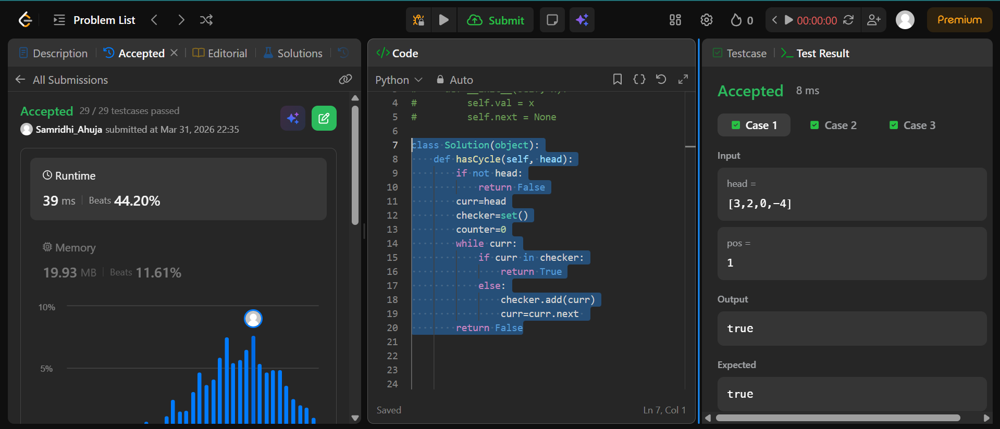

## Easy Solution
```class Solution(object):
    def hasCycle(self, head):
        if not head:
            return False
        curr=head
        checker=set()
        counter=0
        while curr:
            if curr in checker:
                return True
            else:
                checker.add(curr)
                curr=curr.next 
        return False
```

