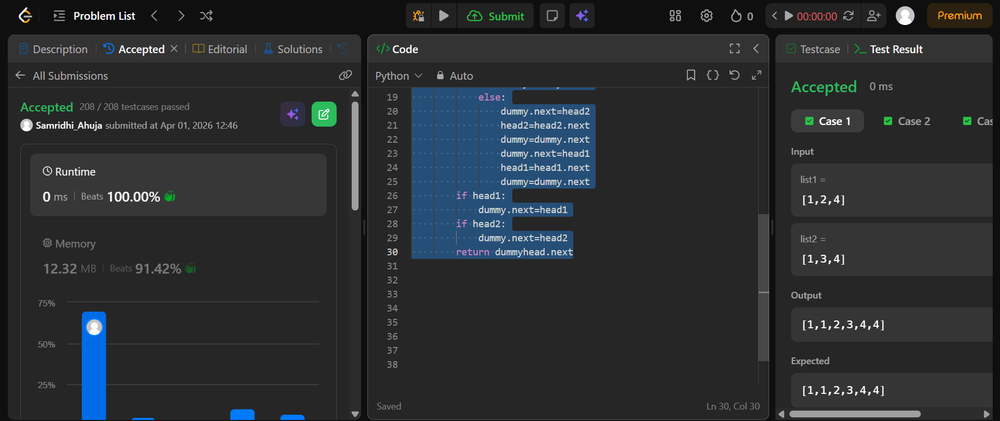
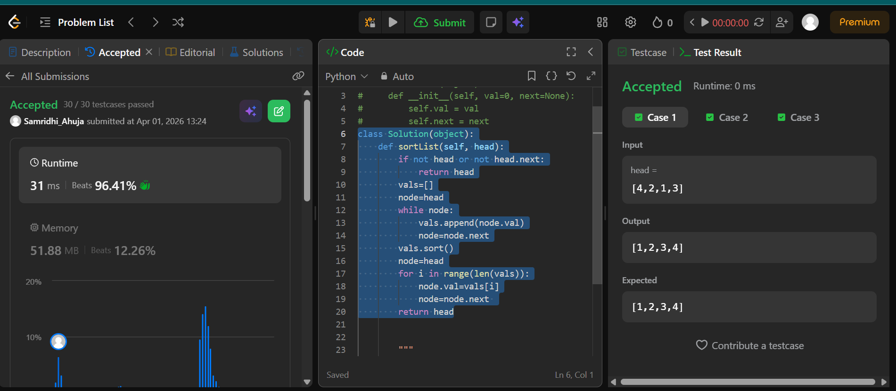

## Easy Solution
```class Solution(object):
    def mergeTwoLists(self, head1, head2):
        dummyhead=ListNode(-1)
        dummy=dummyhead
        while head1 and head2:
            if head1.val<head2.val:
                dummy.next=head1
                head1=head1.next
                dummy=dummy.next
            elif head2.val<head1.val:
                dummy.next=head2
                head2=head2.next
                dummy=dummy.next
            else:
                dummy.next=head2
                head2=head2.next
                dummy=dummy.next
                dummy.next=head1
                head1=head1.next
                dummy=dummy.next
        if head1:
            dummy.next=head1
        if head2:
            dummy.next=head2
        return dummyhead.next
```


## Intermediate Solution 
```class Solution(object):
    def sortList(self, head):
        if not head or not head.next:
            return head
        vals=[]
        node=head
        while node:
            vals.append(node.val)
            node=node.next
        vals.sort()
        node=head
        for i in range(len(vals)):
            node.val=vals[i]
            node=node.next 
        return head
```



