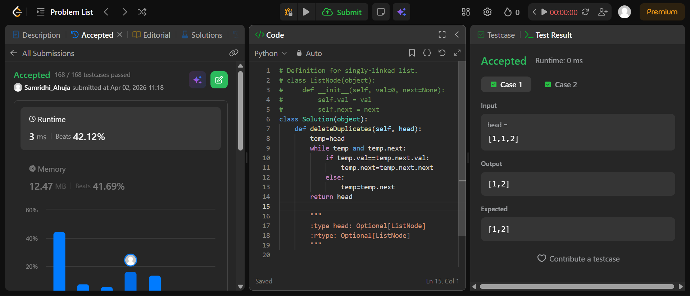
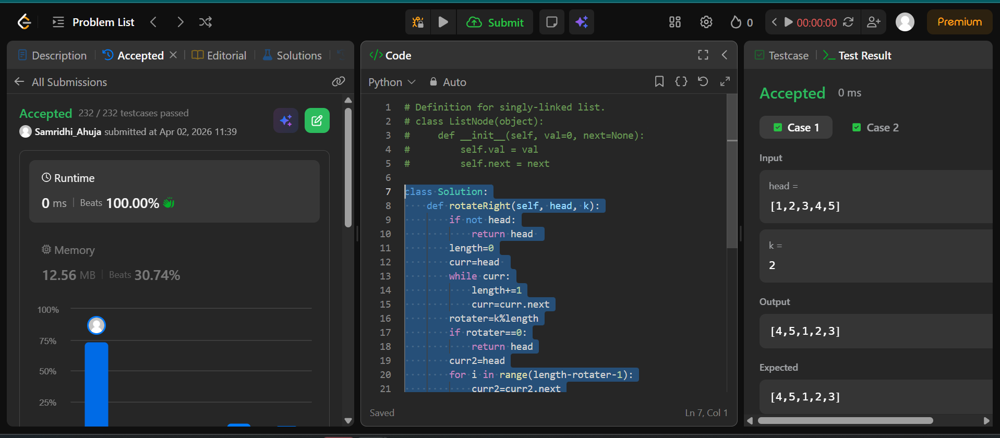

## Easy Solution
```class Solution(object):
    def deleteDuplicates(self, head):
        temp=head
        while temp and temp.next:
            if temp.val==temp.next.val:
                temp.next=temp.next.next
            else:
                temp=temp.next 
        return head
```


## Intermediate Solution 
```class Solution:
    def rotateRight(self, head, k):
        if not head:
            return head 
        length=0
        curr=head 
        while curr:
            length+=1
            curr=curr.next
        rotater=k%length
        if rotater==0:
            return head
        curr2=head
        for i in range(length-rotater-1):
            curr2=curr2.next
        reshead=curr2.next
        curr2.next=None
        curr3=reshead
        while curr3.next:
            curr3=curr3.next
        curr3.next=head
        return reshead
```



