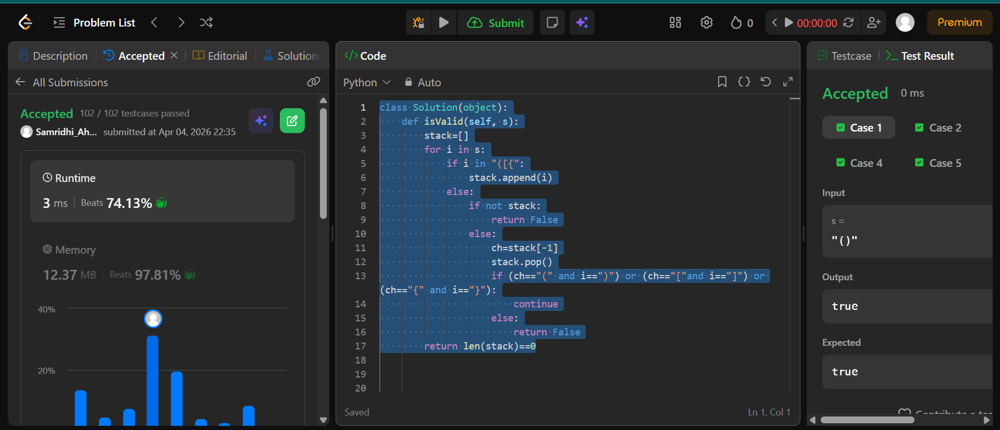

## Easy Solution
```class Solution(object):
    def isValid(self, s):
        stack=[]
        for i in s:
            if i in "([{":
                stack.append(i)
            else:
                if not stack:
                    return False
                else:
                    ch=stack[-1]
                    stack.pop()
                    if (ch=="(" and i==")") or (ch=="["and i=="]") or (ch=="{" and i=="}"):
                        continue
                    else:
                        return False
        return len(stack)==0
```



