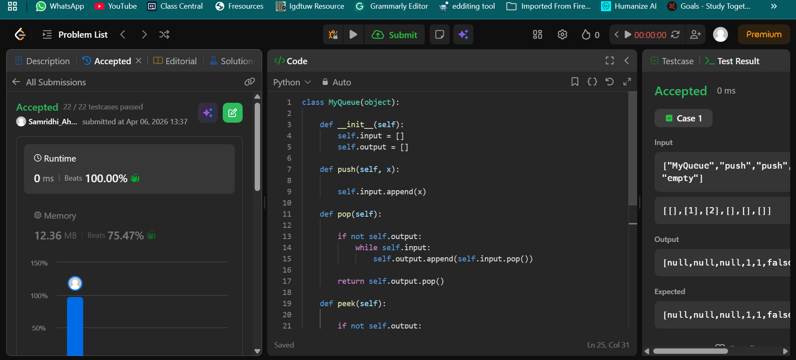
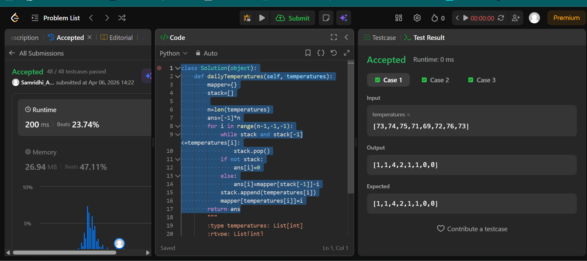

## Easy Solution
```class MyQueue(object):

    def __init__(self):
        self.input = []
        self.output = []

    def push(self, x):

        self.input.append(x)

    def pop(self):
      
        if not self.output:
            while self.input:
                self.output.append(self.input.pop())
        
        return self.output.pop()

    def peek(self):
        
        if not self.output:
            while self.input:
                self.output.append(self.input.pop())
        
        return self.output[-1]

    def empty(self):
        
        return not self.input and not self.output
```


## Intermediate Solution 
```class Solution(object):
    def dailyTemperatures(self, temperatures):
        mapper={}
        stack=[]
        
        n=len(temperatures)
        ans=[-1]*n
        for i in range(n-1,-1,-1):
            while stack and stack[-1]<=temperatures[i]:
                stack.pop()
            if not stack:
                ans[i]=0
            else:
                ans[i]=mapper[stack[-1]]-i
            stack.append(temperatures[i])
            mapper[temperatures[i]]=i
        return ans
```



