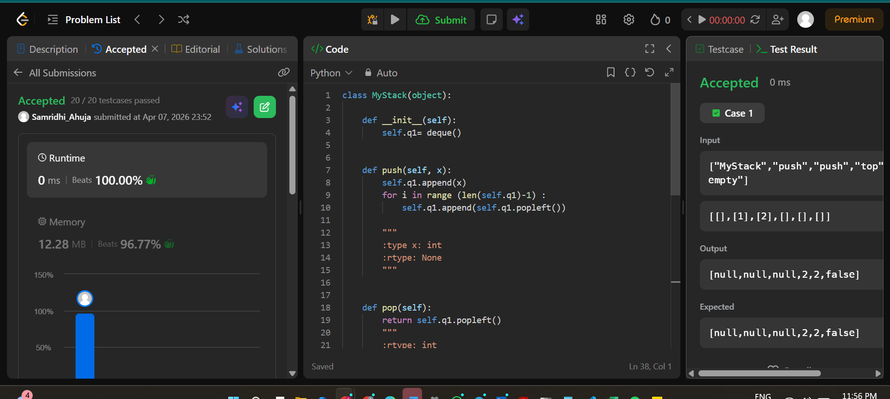

## Easy Solution
```class MyStack(object):

    def __init__(self):
        self.q1= deque()
        

    def push(self, x):
        self.q1.append(x)
        for i in range (len(self.q1)-1) :
            self.q1.append(self.q1.popleft())
        
        """
        :type x: int
        :rtype: None
        """
        

    def pop(self):
        return self.q1.popleft()
        """
        :rtype: int
        """
        

    def top(self):
        return self.q1[0]
        """
        :rtype: int
        """
        

    def empty(self):
        return not self.q1
        """
        :rtype: bool
        """
```
