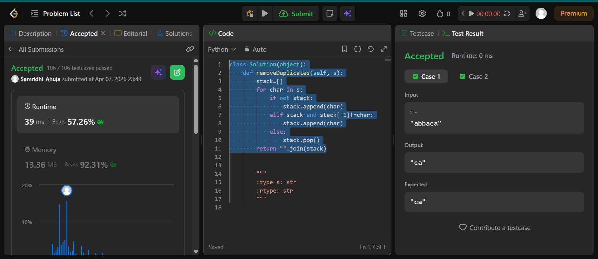

## Easy Solution
```class Solution(object):
    def removeDuplicates(self, s):
        stack=[]
        for char in s:
            if not stack:
                stack.append(char)
            elif stack and stack[-1]!=char:
                stack.append(char)
            else:
                stack.pop()
        return "".join(stack)
```
