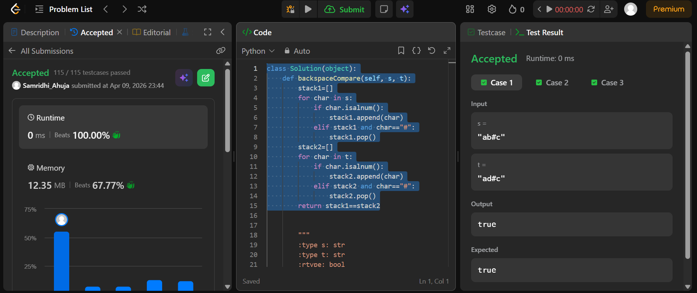

## Easy Solution
```class Solution(object):
    def backspaceCompare(self, s, t):
        stack1=[]
        for char in s:
            if char.isalnum():
                stack1.append(char)
            elif stack1 and char=="#":
                stack1.pop()
        stack2=[]
        for char in t:
            if char.isalnum():
                stack2.append(char)
            elif stack2 and char=="#":
                stack2.pop()
        return stack1==stack2
```
