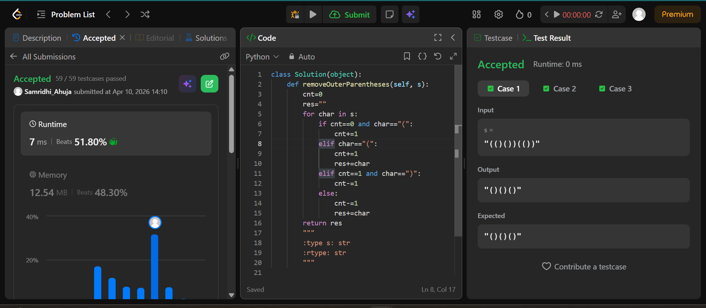
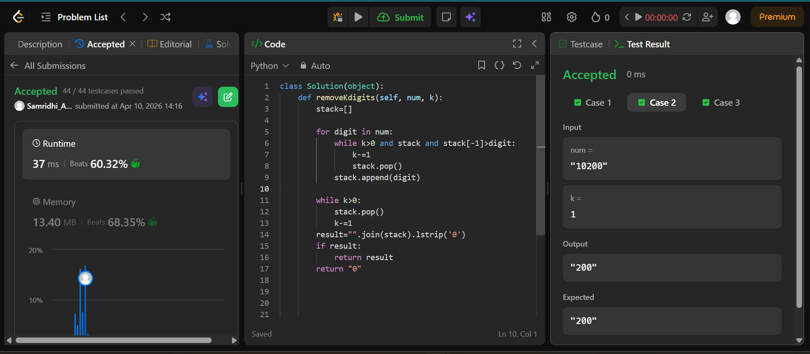
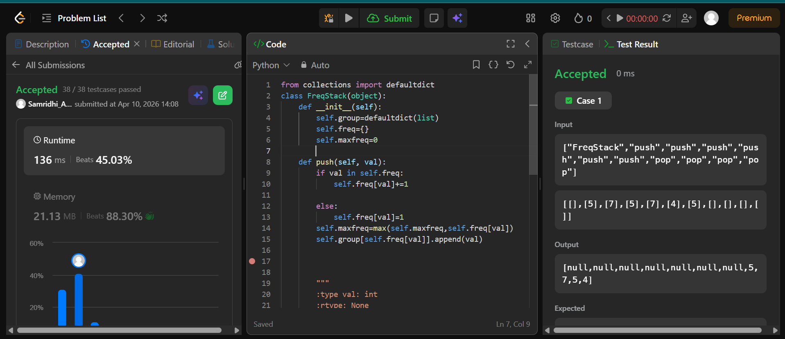

## Easy Solution
```class Solution(object):
    def removeOuterParentheses(self, s):
        cnt=0
        res=""
        for char in s:
            if cnt==0 and char=="(":
                cnt+=1
            elif char=="(":
                cnt+=1
                res+=char
            elif cnt==1 and char==")":
                cnt-=1
            else:
                cnt-=1
                res+=char
        return res
```


## Intermediate Solution
```class Solution(object):
    def removeKdigits(self, num, k):
        stack=[]
        
        for digit in num:
            while k>0 and stack and stack[-1]>digit:
                k-=1
                stack.pop()
            stack.append(digit)

        while k>0:
            stack.pop()
            k-=1
        result="".join(stack).lstrip('0')
        if result:
            return result 
        return "0"

```


## Hard Solution
```from collections import defaultdict
class FreqStack(object):
    def __init__(self):
        self.group=defaultdict(list)
        self.freq={}
        self.maxfreq=0
        
    def push(self, val):
        if val in self.freq:
            self.freq[val]+=1
        
        else:
            self.freq[val]=1
        self.maxfreq=max(self.maxfreq,self.freq[val])
        self.group[self.freq[val]].append(val)
    
       

        """
        :type val: int
        :rtype: None
        """
        

    def pop(self):
        val=self.group[self.maxfreq].pop()
        self.freq[val]-=1
        if not self.group[self.maxfreq]:
            self.maxfreq-=1
        return val


        """
        :rtype: int
        """
```

