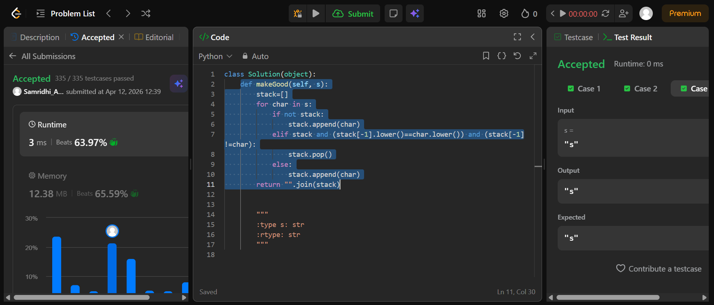
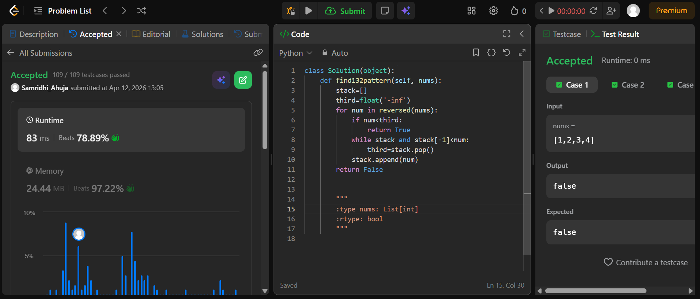

## Easy Solution
```def makeGood(self, s):
        stack=[]
        for char in s:
            if not stack:
                stack.append(char)
            elif stack and (stack[-1].lower()==char.lower()) and (stack[-1]!=char):
                stack.pop()
            else:
                stack.append(char)
        return "".join(stack)
```


## Intermediate Solution
```class Solution(object):
    def find132pattern(self, nums):
        stack=[]
        third=float('-inf')
        for num in reversed(nums):
            if num<third:
                return True
            while stack and stack[-1]<num:
                third=stack.pop()
            stack.append(num)
        return False
```


