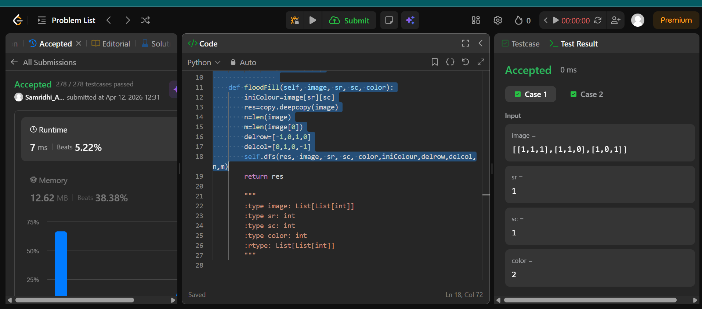
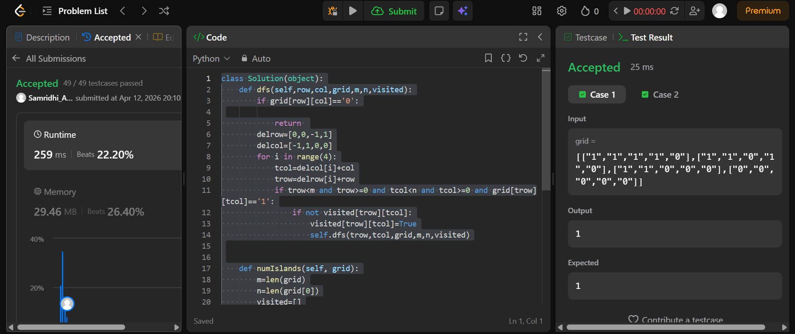
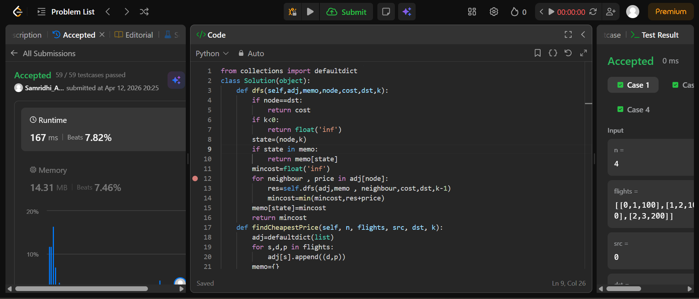

## Easy Solution
```import copy
class Solution(object):
    def dfs(self,res, image, row, col, color,iniColour,delrow,delcol,n,m):
        res[row][col]=color
        for i in range(4):
            temprow=row+delrow[i]
            tempcol=col+delcol[i]
            if temprow<n and tempcol<m and temprow>=0 and tempcol>=0 and image[temprow][tempcol]==iniColour and res[temprow][tempcol]!=color:
                self.dfs(res, image, temprow, tempcol, color,iniColour,delrow,delcol,n,m)
                
    def floodFill(self, image, sr, sc, color):
        iniColour=image[sr][sc]
        res=copy.deepcopy(image)
        n=len(image)
        m=len(image[0])
        delrow=[-1,0,1,0]
        delcol=[0,1,0,-1]
        self.dfs(res, image, sr, sc, color,iniColour,delrow,delcol,n,m)
```


## Intermediate Solution
```class Solution(object):
    def dfs(self,row,col,grid,m,n,visited):
        if grid[row][col]=='0':

            return 
        delrow=[0,0,-1,1]
        delcol=[-1,1,0,0]
        for i in range(4):
            tcol=delcol[i]+col
            trow=delrow[i]+row
            if trow<m and trow>=0 and tcol<n and tcol>=0 and grid[trow][tcol]=='1':
                if not visited[trow][tcol]:
                    visited[trow][tcol]=True
                    self.dfs(trow,tcol,grid,m,n,visited)


    def numIslands(self, grid):
        m=len(grid)
        n=len(grid[0])
        visited=[]
        islands=0
        for i in range(m):
            visited.append([False]*n)
        for row in range(m):
            for col in range(n):
                if grid[row][col]=='1' and not visited[row][col]:
                    islands+=1
                    self.dfs(row,col,grid,m,n,visited)
        return islands
```


## Hard Solution
```from collections import defaultdict 
class Solution(object):
    def dfs(self,adj,memo,node,cost,dst,k):
        if node==dst:
            return cost
        if k<0:
            return float('inf')
        state=(node,k)
        if state in memo:
            return memo[state]
        mincost=float('inf')
        for neighbour , price in adj[node]:
            res=self.dfs(adj,memo , neighbour,cost,dst,k-1)
            mincost=min(mincost,res+price)
        memo[state]=mincost
        return mincost
    def findCheapestPrice(self, n, flights, src, dst, k):
        adj=defaultdict(list)
        for s,d,p in flights:
            adj[s].append((d,p))
        memo={}
        cost=self.dfs(adj,memo,src,0,dst,k)
        if cost==float('inf'):
            return -1
        return cost
```
