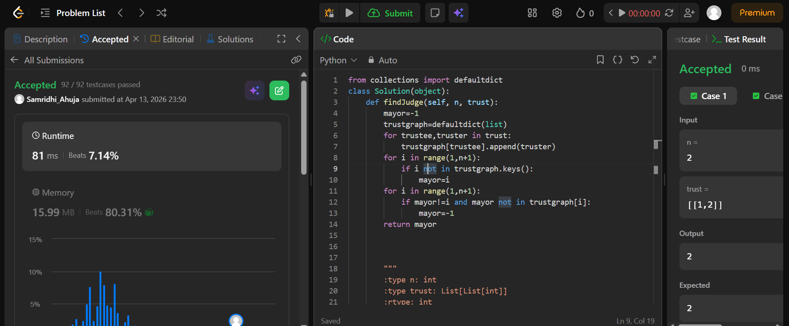
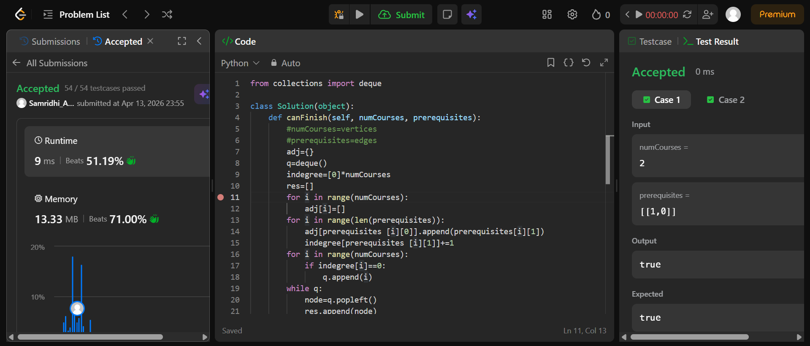

## Easy Solution
```from collections import defaultdict
class Solution(object):
    def findJudge(self, n, trust):
        mayor=-1
        trustgraph=defaultdict(list)
        for trustee,truster in trust:
            trustgraph[trustee].append(truster)
        for i in range(1,n+1):
            if i not in trustgraph.keys():
                mayor=i
        for i in range(1,n+1):
            if mayor!=i and mayor not in trustgraph[i]:
                mayor=-1
        return mayor
```


## Intermediate Solution
```from collections import deque

class Solution(object):
    def canFinish(self, numCourses, prerequisites):
        #numCourses=vertices
        #prerequisites=edges 
        adj={}
        q=deque()
        indegree=[0]*numCourses
        res=[]
        for i in range(numCourses):
            adj[i]=[]
        for i in range(len(prerequisites)):
            adj[prerequisites [i][0]].append(prerequisites[i][1])
            indegree[prerequisites [i][1]]+=1
        for i in range(numCourses):
            if indegree[i]==0:
                q.append(i)
        while q:
            node=q.popleft()
            res.append(node)
            for neighbour in adj[node]:
                indegree[neighbour]-=1
                if indegree[neighbour]==0:
                    q.append(neighbour)
        return len(res)==numCourses
```


