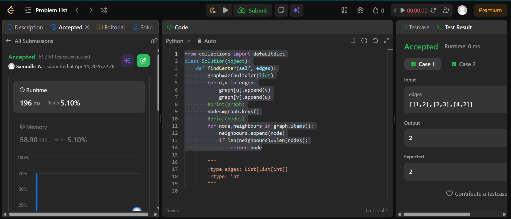

## Easy Solution
```from collections import defaultdict
class Solution(object):
    def findCenter(self, edges):
        graph=defaultdict(list)
        for u,v in edges:
            graph[u].append(v)
            graph[v].append(u)
        #print(graph)
        nodes=graph.keys()
        #print(nodes)
        for node,neighbours in graph.items():
            neighbours.append(node)
            if len(neighbours)==len(nodes):
                return node
```



## Intermediate Solution
```from collections import defaultdict
class Solution(object):
    def dfs(self,node):
        self.visited[node]=True
        for neighbour in self.adj[node]:
            if not self.visited[neighbour]:
                self.dfs(neighbour)
    def findCircleNum(self, isConnected):
        self.adj=defaultdict(list)
        n=len(isConnected)
        self.visited=[False]*n
        provinces=0
        for i in range(n):
            for j in range(n):
                if isConnected[i][j]==1:
                    self.adj[i].append(j)
        for i in range(n):
            if not self.visited[i]:
                provinces+=1
                self.dfs(i)
        return provinces
```


