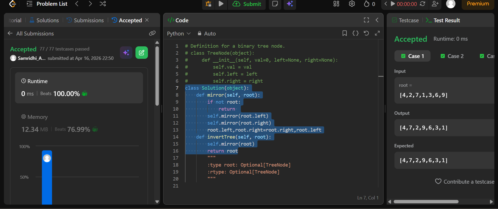

## Easy Solution
```class Solution(object):
    def mirror(self, root):
        if not root:
            return 
        self.mirror(root.left)
        self.mirror(root.right)
        root.left,root.right=root.right,root.left
    def invertTree(self, root):
        self.mirror(root)
        return root
```
