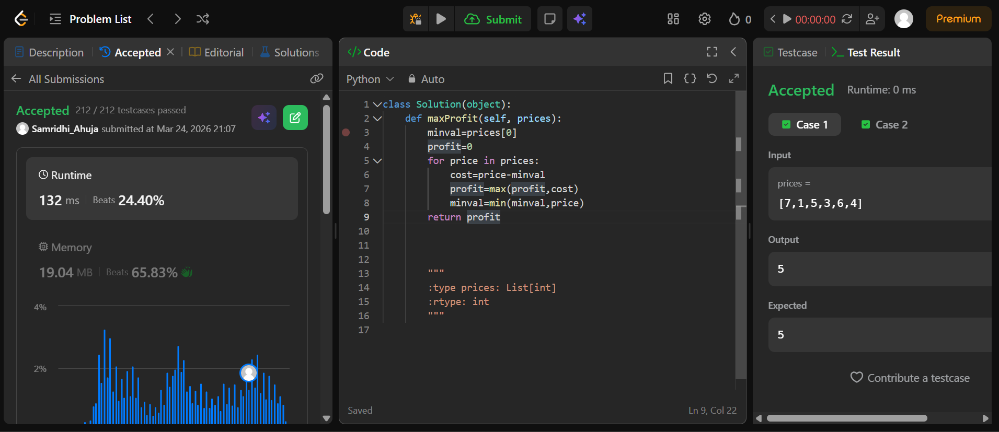
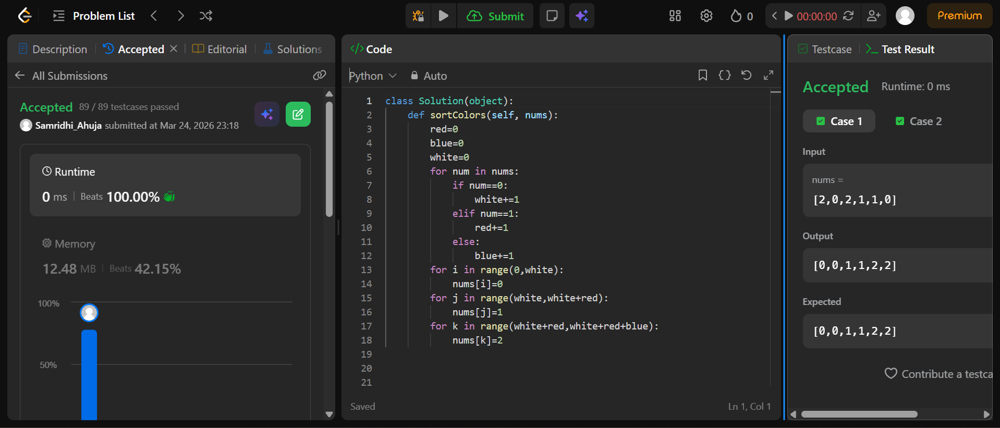

## Easy Solution
Greedy Approach we find cost using the price of selling on current day - min value before;\
we find the profit by taking max value of cost \
class Solution(object):\
    def maxProfit(self, prices):\
        minval=prices[0]\
        profit=0\
        for price in prices:\
            cost=price-minval\
            profit=max(profit,cost)\
            minval=min(minval,price)\
        return profit

## Intermediate Solution 
we define variables for red white and blue ...count each then and thenm replace values in order

def sortColors(self, nums):
        red=0
        blue=0
        white=0
        for num in nums:
            if num==0:
                white+=1
            elif num==1:
                red+=1
            else:
                blue+=1
        for i in range(0,white):
            nums[i]=0
        for j in range(white,white+red):
            nums[j]=1
        for k in range(white+red,white+red+blue):
            nums[k]=2

