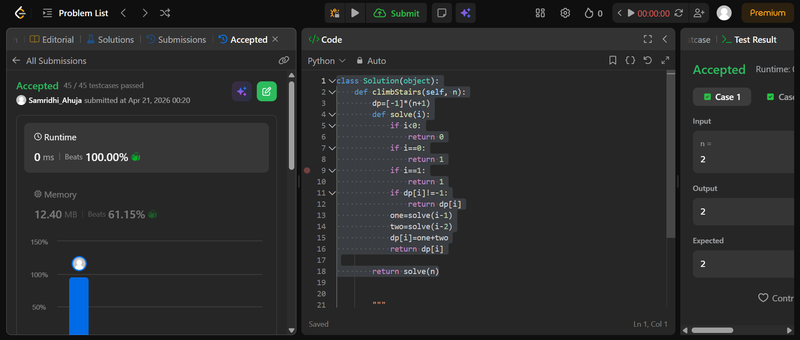

## Easy Solution
```class Solution(object):
    def climbStairs(self, n):
        dp=[-1]*(n+1)
        def solve(i):
            if i<0:
                return 0
            if i==0:
                return 1
            if i==1:
                return 1
            if dp[i]!=-1:
                return dp[i]
            one=solve(i-1)
            two=solve(i-2)
            dp[i]=one+two
            return dp[i]

        return solve(n)
```
