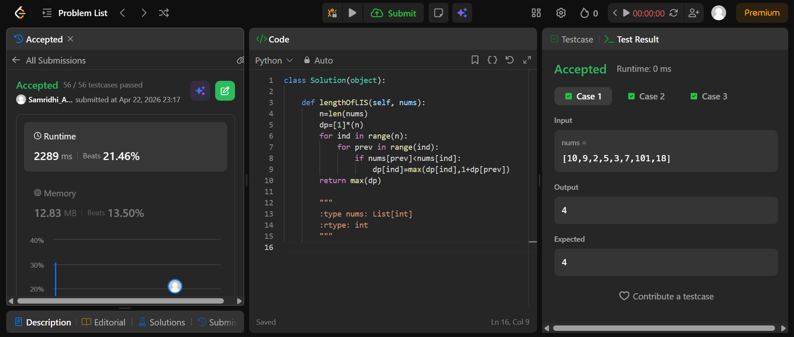

## Easy Solution
```class Solution(object):

    def lengthOfLIS(self, nums):
        n=len(nums)
        dp=[1]*(n)
        for ind in range(n):
            for prev in range(ind):
                if nums[prev]<nums[ind]:
                    dp[ind]=max(dp[ind],1+dp[prev])
        return max(dp)
```
