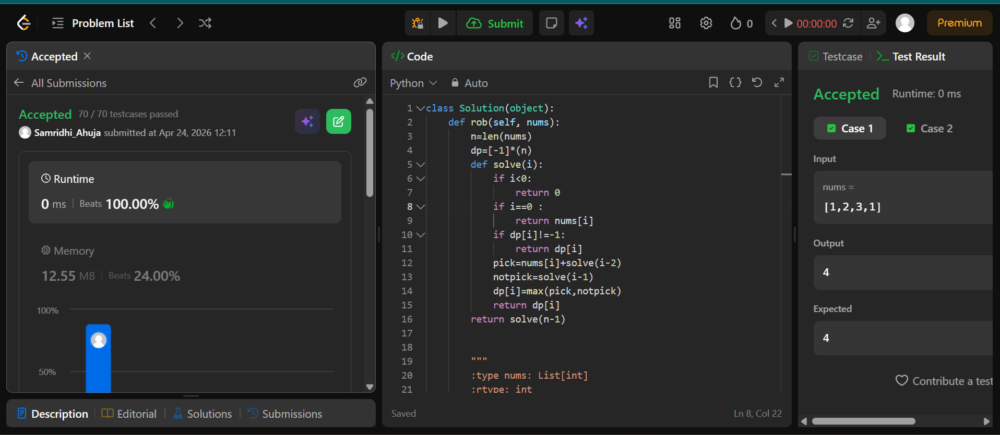

## Easy Solution
```class Solution(object):
    def rob(self, nums):
        n=len(nums)
        dp=[-1]*(n)
        def solve(i):
            if i<0:
                return 0
            if i==0 :
                return nums[i]
            if dp[i]!=-1:
                return dp[i]
            pick=nums[i]+solve(i-2)
            notpick=solve(i-1)
            dp[i]=max(pick,notpick)
            return dp[i]
        return solve(n-1)
```
