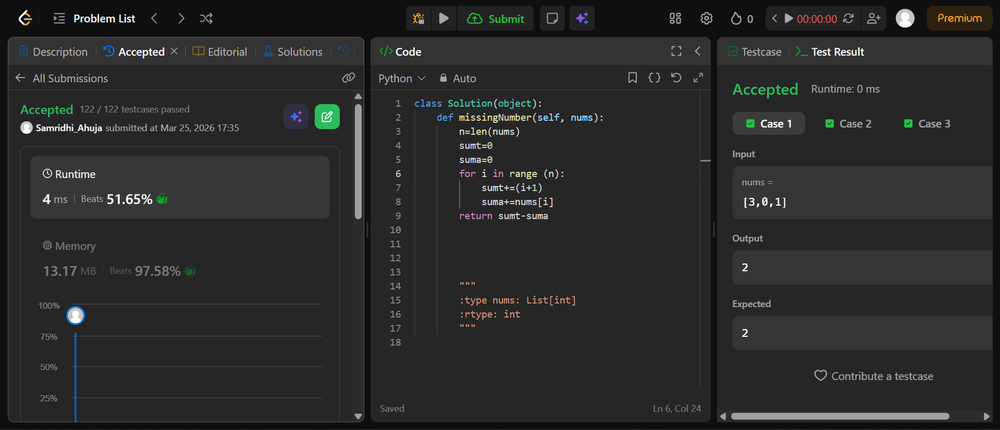
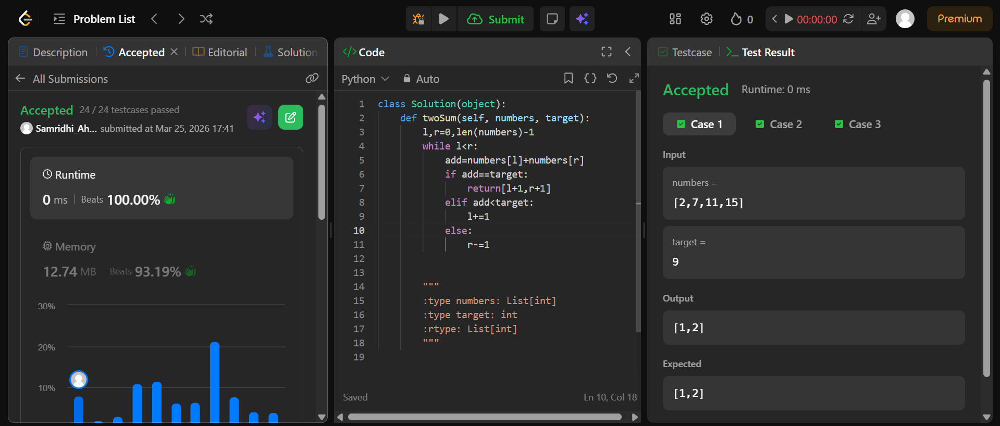

## Easy Solution
class Solution(object):\
    def missingNumber(self, nums):\
        n=len(nums)\
        sumt=0\
        suma=0\
        for i in range (n):\
            sumt+=(i+1)\
            suma+=nums[i]\
        return sumt-suma\

## Intermediate Solution
class Solution(object):\
    def twoSum(self, numbers, target):\
        l,r=0,len(numbers)-1\
        while l<r:\
            add=numbers[l]+numbers[r]\
            if add==target:\
                return[l+1,r+1]\
            elif add<target:\
                l+=1\
            else:\
                r-=1\   

## Hard Solution
