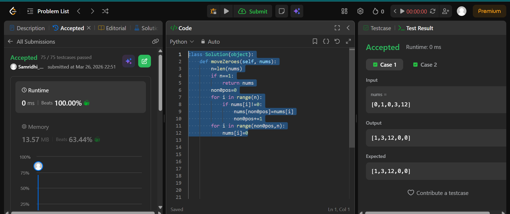
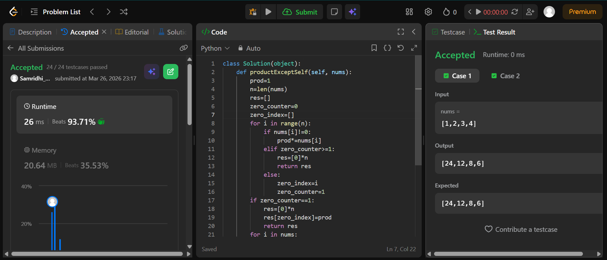

## Easy Solution
keep a index for non zero values, move every non zero value to said index then change rest of the values to zeroes
class Solution(object):\
    def moveZeroes(self, nums):\
        n=len(nums)\
        if n==1:\
            return nums\
        non0pos=0\
        for i in range(n):\
            if nums[i]!=0:\
                nums[non0pos]=nums[i]\
                non0pos+=1\
        for i in range(non0pos,n):\
            nums[i]=0

## Intermediate Solution
if there are more than 2 zeroes in the  return a zero array as res\
if one zero , create an array with all zero except the one index which has zero and put product rest of the array there\
else take the product of whole array and then divide the product with the value of that index\

class Solution(object):\
    def productExceptSelf(self, nums):\
        prod=1\
        n=len(nums)\
        res=[]\
        zero_counter=0\
        zero_index=[]\
        for i in range(n):\
            if nums[i]!=0:\
                prod*=nums[i]\
            elif zero_counter>=1:\
                res=[0]*n\
                return res\
            else:\
                zero_index=i\
                zero_counter=1\
        if zero_counter==1:\
            res=[0]*n\
            res[zero_index]=prod\
            return res\
        for i in nums:\
            res.append(prod//i)\
        return res
