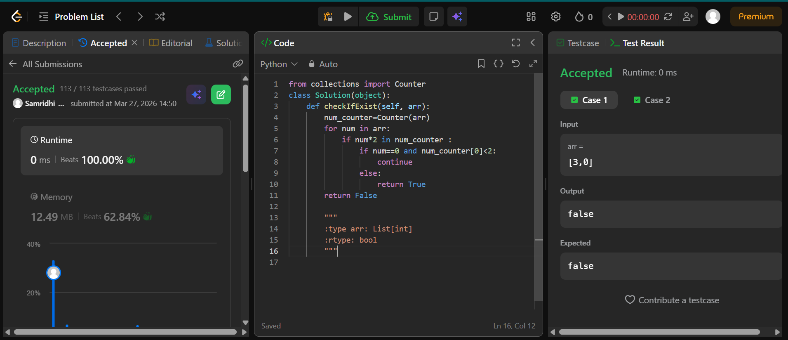
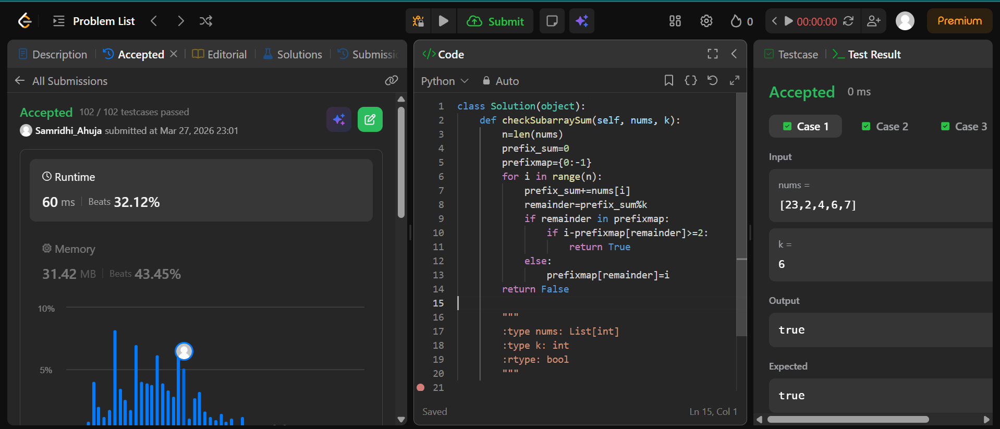

## Easy Solution
Create a counter for checking and handle zero condition \
from collections import Counter\
class Solution(object):\
    def checkIfExist(self, arr):\
        num_counter=Counter(arr)\
        for num in arr:\
            if num*2 in num_counter :\
                if num==0 and num_counter[0]<2:\
                    continue \
                else:\
                    return True\
        return False


## Intermediate Solution
```class Solution(object):
    def checkSubarraySum(self, nums, k):
        n=len(nums)
        prefix_sum=0
        prefixmap={0:-1}
        for i in range(n):
            prefix_sum+=nums[i]
            remainder=prefix_sum%k
            if remainder in prefixmap:
                if i-prefixmap[remainder]>=2:
                    return True
            else:
                prefixmap[remainder]=i
        return False
```
