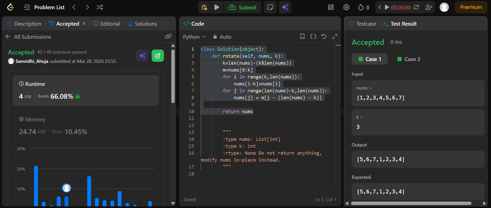

## Easy Solution
```class Solution(object):
    def rotate(self, nums, k):
        k=len(nums)-(k%len(nums))
        m=nums[0:k]
        for i in range(k,len(nums)):
            nums[i-k]=nums[i]
        for j in range(len(nums)-k,len(nums)):
            nums[j] = m[j - (len(nums) - k)]

        return nums
```


