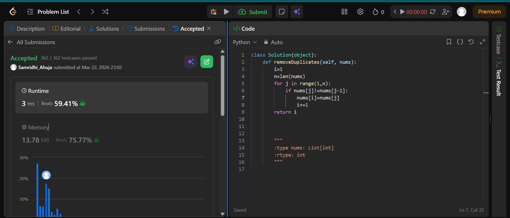

Two pointer approach - i keeps a check of the unique elements in the array and j iterates through the array...each time j comes across a new unique element ; it places it at index i ;  then index i is incremented 
